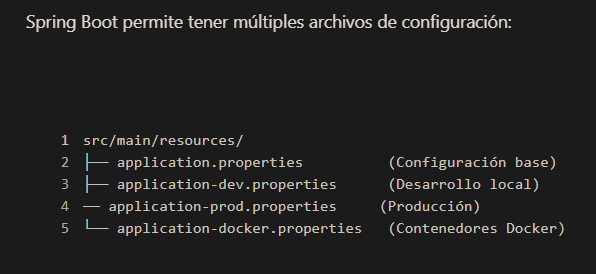
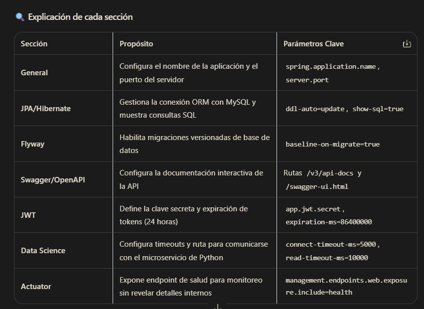
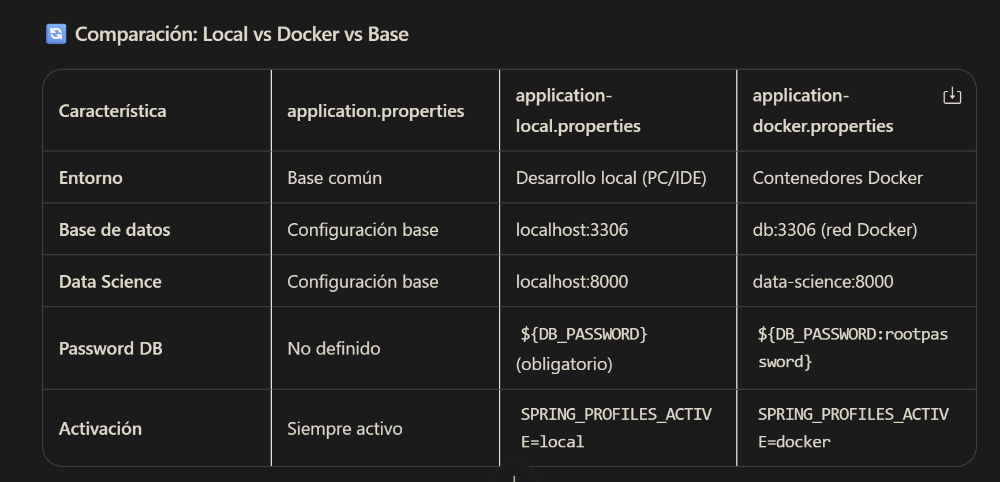
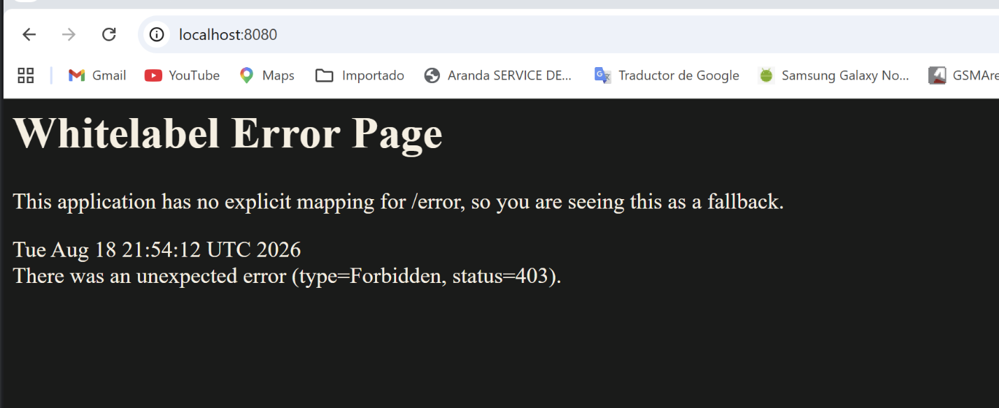

# Energia Backend API

Backend REST desarrollado con Spring Boot para analizar consumo energético, clasificar eficiencia, estimar costo mensual y generar recomendaciones de ahorro. El proyecto incluye autenticación JWT, roles de usuario, documentación OpenAPI/Swagger, persistencia con Spring Data JPA + MySQL y una integración con el servicio de Data Science (FastAPI + XGBoost) con respaldo automático a un motor de reglas local.

## Tabla de contenido

- [Descripción general](#descripción-general)
- [Stack tecnológico](#stack-tecnológico)
- [Arquitectura del proyecto](#arquitectura-del-proyecto)
- [Estructura de carpetas](#estructura-de-carpetas)
- [Requisitos previos](#requisitos-previos)
- [Configuración](#configuración)
    - [Perfiles de Spring Boot](#perfiles-de-spring-boot)
    - [application.properties](#applicationproperties)
    - [application-docker.properties](#application-docker-properties)
    - [application-local.properties](#application-local-properties)
- [Ejecución local](#ejecución-local)
- [Docker](#docker)
    - [Requisitos previos para Docker](#requisitos-previos-para-docker)
    - [Dockerfile y .dockerignore](#dockerfile-y-dockerignore)
    - [Construir y ejecutar el contenedor](#construir-y-ejecutar-el-contenedor)
    - [Logs, estado y healthcheck](#logs-estado-y-healthcheck)
    - [Detener y eliminar el contenedor](#detener-y-eliminar-el-contenedor)
- [Seguridad y autenticación](#seguridad-y-autenticación)
    - [Usuario administrador inicial](#usuario-administrador-inicial)
    - [Login](#login)
    - [Registro de usuarios](#registro-de-usuarios)
    - [Uso del token](#uso-del-token)
    - [Rutas públicas y permisos por rol](#rutas-públicas-y-permisos-por-rol)
- [Endpoints de la API](#endpoints-de-la-api)
    - [Autenticación](#autenticación)
    - [Análisis energético](#análisis-energético)
    - [Gestión de usuarios](#gestión-de-usuarios)
    - [Crear análisis energético](#crear-análisis-energético)
    - [Consultar análisis por ID](#consultar-análisis-por-id)
    - [Consultar historial](#consultar-historial)
- [Reglas de negocio](#reglas-de-negocio)
    - [Motor de reglas local](#motor-de-reglas-local)
    - [Integración con Data Science](#integración-con-data-science)
    - [Recomendaciones generadas](#recomendaciones-generadas)
- [Validaciones](#validaciones)
- [Manejo de errores](#manejo-de-errores)
- [Base de datos](#base-de-datos)
- [Documentación Swagger/OpenAPI](#documentación-swaggeropenapi)
- [Pruebas](#pruebas)
- [Notas de seguridad](#notas-de-seguridad)
- [Paquete base](#paquete-base)

---

## Descripción general

La aplicación permite registrar análisis de consumo energético a partir de datos como consumo mensual en kWh, uso en horario pico, cantidad de equipos, tipo de inmueble, horas de alto consumo, número de habitantes, antigüedad del inmueble, calefacción y aire acondicionado. Con esa información, el backend:

- Intenta obtener la predicción desde el servicio de **Data Science** (modelo XGBoost).
- Si el servicio no está disponible, aplica automáticamente un **motor de reglas local** como respaldo (*fallback*).
- Clasifica el consumo como `Eficiente`, `Moderado` o `Ineficiente`.
- Calcula un costo mensual estimado usando una tarifa fija por kWh.
- Genera recomendaciones según la categoría y los patrones de consumo.
- Persiste el resultado en MySQL, asociado al usuario autenticado.
- Permite consultar el historial de análisis del usuario y cada análisis por ID.
- Protege los endpoints mediante **JWT** con roles `ADMIN` y `USER`.

---

## Stack tecnológico

| Tecnología | Uso |
| --- | --- |
| Java 21 | Lenguaje base del proyecto |
| Spring Boot 3.3.5 | Framework principal |
| Spring Web | Exposición de API REST |
| Spring Security | Seguridad HTTP, autenticación stateless y roles |
| JJWT 0.12.6 | Generación y validación de tokens JWT |
| Spring Data JPA | Persistencia y repositorios |
| MySQL 8 | Base de datos para desarrollo y Docker |
| Flyway | Migraciones de base de datos |
| H2 Database (scope test) | Base de datos en memoria solo para pruebas |
| Jakarta Validation | Validación de DTOs de entrada |
| Lombok 1.18.38 | Reducción de código repetitivo |
| SpringDoc OpenAPI 2.6.0 | Documentación interactiva de la API |
| Spring Boot Actuator | Health check para monitoreo y Docker |
| RestTemplate | Cliente HTTP para consumir el servicio de Data Science |
| Maven / Maven Wrapper | Gestión de dependencias, build y ejecución del proyecto |

---

## Arquitectura del proyecto

El proyecto sigue una arquitectura por capas:

- `controller`: expone endpoints REST.
- `service`: contiene la lógica de negocio del análisis energético y la autenticación.
- `repository`: abstrae el acceso a datos con Spring Data JPA.
- `entity`: define el modelo persistido en base de datos.
- `dto`: define contratos de entrada y salida de la API.
    - `request`: DTOs de entrada.
    - `response`: DTOs de salida.
    - `datascience`: DTOs de comunicación con el servicio de Data Science.
- `client`: cliente HTTP para consumir la API de Data Science.
- `security`: gestiona JWT y autenticación por request.
- `config`: centraliza seguridad, OpenAPI, JSON, zona horaria, constantes e inicialización de datos.
- `exception`: maneja errores de forma centralizada.
- `enums`: define valores de dominio como categorías, tipos de inmueble y roles.

---

## Estructura de carpetas

```
.
├── .dockerignore
├── Dockerfile
├── HELP.md
├── mvnw
├── mvnw.cmd
├── pom.xml
├── assets/                          # Imágenes utilizadas en el README
└── src
    ├── main
    │   ├── java/com/hackathon/energia_backend
    │   │   ├── EnergiaBackendApplication.java
    │   │   ├── client/              # Cliente HTTP para Data Science
    │   │   ├── config/              # Seguridad, OpenAPI, JSON, zona horaria, constantes y datos iniciales
    │   │   ├── controller/          # Endpoints REST
    │   │   ├── dto/                 # Contratos de entrada y salida
    │   │   │   ├── datascience/     # DTOs de comunicación con Data Science
    │   │   │   ├── request/         # DTOs de entrada
    │   │   │   └── response/        # DTOs de salida
    │   │   ├── entity/              # Modelo persistido (JPA)
    │   │   ├── enums/               # Categorías, tipos de inmueble y roles
    │   │   ├── exception/           # Manejo centralizado de errores
    │   │   ├── repository/          # Repositorios Spring Data JPA
    │   │   ├── security/            # JWT y autenticación por request
    │   │   └── service/             # Lógica de negocio
    │   └── resources
    │       ├── application.properties               # Configuración base
    │       ├── application-docker.properties        # Perfil docker
    │       ├── application-local.properties         # Perfil local
    │       ├── db/migration/                        # Migraciones Flyway
    │       └── static/
    │           └── swagger-custom.html              # Interfaz Swagger personalizada
    └── test
        └── java/com/hackathon/energia_backend
            └── EnergiaBackendApplicationTests.java
```

---

## Requisitos previos

- **Java 21**.
- **Maven** instalado globalmente, o restaurar la configuración completa del Maven Wrapper.
- **MySQL 8** corriendo localmente (perfil `local`) o **Docker Desktop** (perfil `docker`).

> Nota: el repositorio contiene `mvnw` y `mvnw.cmd`, pero actualmente no contiene `.mvn/wrapper/maven-wrapper.properties`. Por eso, el wrapper no puede ejecutarse hasta que se restaure esa carpeta/configuración.

---

## Configuración

La configuración se centraliza en `src/main/resources/` y se divide en un archivo base más dos perfiles de entorno.



### Perfiles de Spring Boot

| Perfil | Uso | Host de conexión |
| --- | --- | --- |
| `docker` | Contenedores (activado por `docker-compose.yml`) | `db` (nombre del servicio en la red de Docker) |
| `local` | Desarrollo local (IDE, sin Docker) | `localhost` |

El perfil se activa con la variable `SPRING_PROFILES_ACTIVE`.

### application.properties

El archivo `application.properties` es el corazón de la configuración de Spring Boot. Centraliza los parámetros comunes a todos los perfiles:

- **Configuración de JPA/Hibernate** (mapeo objeto-relacional)
- **Migraciones de base de datos con Flyway**
- **Documentación API con Swagger/OpenAPI**
- **Autenticación JWT** (secreto y expiración)
- **Comunicación con el servicio de Data Science** (ruta de predicción y timeouts)
- **Endpoints de monitoreo y salud**

#### Contenido del archivo

```properties
# ==========================================
# Configuración General (común para todos los perfiles)
# ==========================================
spring.application.name=energia-backend
server.port=8080

# ==========================================
# JPA / Hibernate
# ==========================================
spring.jpa.database-platform=org.hibernate.dialect.MySQLDialect
spring.jpa.hibernate.ddl-auto=update
spring.jpa.show-sql=true
spring.jpa.properties.hibernate.format_sql=true

# ==========================================
# Flyway
# ==========================================
spring.flyway.enabled=true
spring.flyway.baseline-on-migrate=true

# ==========================================
# Swagger / OpenAPI
# ==========================================
springdoc.api-docs.path=/v3/api-docs
springdoc.swagger-ui.path=/swagger-ui.html

# ==========================================
# JWT
# ==========================================
app.jwt.secret=MiClaveSecretaSuperSeguraDeAlMenos32CaracteresParaJWT!!!
app.jwt.expiration-ms=86400000

# ==========================================
# API Data Science (FastAPI)
# ==========================================
app.datascience.predict-path=/api/v1/predict/
app.datascience.connect-timeout-ms=5000
app.datascience.read-timeout-ms=10000

# ==========================================
# Expone solo el endpoint de salud para monitoreo básico,
# ocultando detalles internos de la app por seguridad.
# ==========================================
management.endpoints.web.exposure.include=health
management.endpoint.health.show-details=never
```



La zona horaria de la aplicación es configurable mediante la propiedad `app.timezone` (por defecto `UTC`) y se aplica tanto a la JVM (`TimeZoneConfig`) como a la serialización JSON (`JsonConfig`).

### application-docker.properties

Este archivo contiene la configuración **específica para el entorno de contenedores Docker**. Sobrescribe la configuración base cuando se activa el perfil `docker`.

#### Propósito principal

- Usa **variables de entorno** inyectadas desde `docker-compose.yml` para mayor flexibilidad.
- Conecta con los servicios Docker usando sus nombres de red internos (`db`, `data-science`).
- Permite personalización sin recompilar la imagen del contenedor.

#### Contenido del archivo

```properties
# ==========================================
# Perfil: DOCKER (contenedores)
# ==========================================

# Base de datos MySQL dentro de Docker
spring.datasource.url=jdbc:mysql://${DB_HOST:db}:${DB_PORT:3306}/${DB_ENERGI_AI:energia_db}
spring.datasource.driver-class-name=com.mysql.cj.jdbc.Driver
spring.datasource.username=${DB_USER_MYSQL:root}
spring.datasource.password=${DB_PASSWORD:rootpassword}

# API Data Science dentro de Docker
app.datascience.base-url=${DATASCIENCE_URL:http://data-science:8000}
```


#### Características clave

- **Sintaxis de variables de entorno** `${VARIABLE:valor_por_defecto}`: si la variable existe en `docker-compose.yml`, usa ese valor; si no existe, usa el valor por defecto después de `:`.
- **Nombres de host Docker**: `db` es el nombre del servicio de MySQL y `data-science` el del servicio de Python FastAPI, ambos definidos en `docker-compose.yml`.
- **Flexibilidad**: permite cambiar credenciales y configuraciones sin modificar el código, solo editando `docker-compose.yml` o el archivo `.env`.


#### Cómo se activa

En `docker-compose.yml`, el servicio `backend` activa el perfil y define las variables de entorno:

```yaml
backend:
  build: ./backend
  environment:
    SPRING_PROFILES_ACTIVE: docker
    DB_HOST: db
    DB_PORT: 3306
    DB_ENERGI_AI: ${DB_ENERGI_AI:-energia_db}
    DB_USER_MYSQL: ${DB_USER_MYSQL:-root}
    DB_PASSWORD: ${DB_PASSWORD:-rootpassword}
    DATASCIENCE_URL: http://data-science:8000
```


> Spring Boot detecta automáticamente `application-docker.properties` cuando el perfil activo es `docker` y sobrescribe las configuraciones del archivo base. Nunca hardcodees credenciales en este archivo: usa un archivo `.env` externo y no lo subas al repositorio. Asegúrate de que los nombres de host (`db`, `data-science`) coincidan exactamente con los servicios en `docker-compose.yml`.

### application-local.properties

Este archivo contiene la configuración **específica para desarrollo local** (IntelliJ IDEA o tu PC). Sobrescribe la configuración base cuando se activa el perfil `local`.

#### Propósito principal

- Desarrollo en máquina local sin necesidad de Docker.
- Conecta con servicios corriendo en `localhost` (MySQL y Data Science).
- Ideal para debugging y pruebas rápidas desde el IDE.
- Permite usar variables de entorno del sistema operativo o valores por defecto.

#### Contenido del archivo

```properties
# ==========================================
# Perfil: LOCAL (IntelliJ / tu PC)
# ==========================================

# Base de datos MySQL local
spring.datasource.url=jdbc:mysql://${DB_HOST:localhost}:${DB_PORT:3306}/${DB_ENERGI_AI:energia_db}
spring.datasource.driver-class-name=com.mysql.cj.jdbc.Driver
spring.datasource.username=${DB_USER_MYSQL:root}
spring.datasource.password=${DB_PASSWORD}
#spring.datasource.password=${DB_PASSWORD:rootpassword}

# API Data Science local
app.datascience.base-url=${DATASCIENCE_URL:http://localhost:8000}
```


#### Características clave

- **Password sin valor por defecto**: la línea `spring.datasource.password=${DB_PASSWORD}` no tiene valor por defecto, lo cual es intencional por seguridad: obliga al desarrollador a definir la variable de entorno. La línea comentada `#spring.datasource.password=${DB_PASSWORD:rootpassword}` sirve como referencia.
- **Hosts locales**: `localhost` apunta a tu máquina física; puerto `3306` es el estándar de MySQL (o el que hayas mapeado).
- **Flexibilidad**: puedes sobrescribir cualquier valor desde las variables de entorno del sistema operativo o desde IntelliJ IDEA.

#### Cómo se activa

**Opción 1: Desde IntelliJ IDEA**

1. Ve a `Run → Edit Configurations`.
2. En `Active profiles` escribe: `local`.
3. En `Environment variables` agrega:

```text
DB_HOST=localhost;DB_PORT=3306;DB_ENERGI_AI=energia_db;DB_USER_MYSQL=root;DB_PASSWORD=tuPassword
```



**Opción 2: Desde línea de comandos**

```powershell
# Windows PowerShell
$env:SPRING_PROFILES_ACTIVE="local"
$env:DB_PASSWORD="tuPassword"
mvn spring-boot:run
```

```bash
# Linux/Mac
export SPRING_PROFILES_ACTIVE=local
export DB_PASSWORD="tuPassword"
mvn spring-boot:run
```

> **Importante:**
> - Nunca subas credenciales reales al repositorio: si usas un archivo `.env` local, agrégalo a `.gitignore`.
> - MySQL debe estar corriendo: a diferencia del perfil Docker, aquí no se levanta automáticamente.
> - Puerto `3306` disponible: si tienes otro MySQL corriendo, cambia `DB_PORT` en las variables de entorno.
> - Data Science local: el servicio de Python debe estar activo en el puerto `8000` para que las predicciones funcionen; si no lo está, el backend usa el motor de reglas local.

---

## Ejecución local

Desde la raíz del backend (`backend/`), con el perfil `local` activo y MySQL corriendo:

```bash
# Windows PowerShell
$env:SPRING_PROFILES_ACTIVE="local"
$env:DB_PASSWORD="tuPassword"
mvn spring-boot:run
```

```bash
# Linux/macOS
export SPRING_PROFILES_ACTIVE=local
export DB_PASSWORD="tuPassword"
mvn spring-boot:run
```

Si se restaura el Maven Wrapper:

- Windows: `.\mvnw.cmd spring-boot:run`
- Linux/macOS: `./mvnw spring-boot:run`

La API queda disponible en:

```text
http://localhost:8080
```

---

## Docker

### Requisitos previos para Docker

Antes de construir o ejecutar el contenedor es necesario instalar **Docker Desktop** en el equipo; es la aplicación que permite crear, ejecutar y gestionar contenedores:

- **Descarga oficial (Windows / Mac / Linux):** <https://www.docker.com/products/docker-desktop/>
- **Guía oficial de instalación:** <https://docs.docker.com/get-started/get-docker/>
- **Guía específica para Windows:** <https://docs.docker.com/desktop/setup/install/windows-install/>

Pasos de instalación:

1. Descargar el instalador correspondiente a tu sistema operativo desde la página oficial de descarga.
2. Ejecutar el instalador. En Windows, aceptar habilitar **WSL 2** cuando lo solicite (el asistente lo configura automáticamente).
3. Reiniciar el equipo si el instalador lo pide, luego abrir **Docker Desktop** y esperar a que el ícono muestre "Engine running".
4. Verificar que la instalación quedó correcta abriendo una terminal:

```bash
docker --version
docker compose version
```

5. Confirmar que el motor de Docker está activo:

```bash
docker info
```

> Sin Docker Desktop instalado y en ejecución, los comandos `docker build` o `docker run` fallarán con errores como "command not found" o "cannot connect to the Docker daemon".

### Dockerfile y .dockerignore

El backend cuenta con un `Dockerfile` con **build multi-etapa**: la primera etapa compila el proyecto con Maven (Java 21) y la segunda ejecuta el JAR resultante sobre un JRE ligero, con un `HEALTHCHECK` sobre `/actuator/health`.

**`backend/Dockerfile`:**

```dockerfile
# Etapa 1: Compilar con Maven (Java 21)
FROM maven:3.9-eclipse-temurin-21-alpine AS builder
WORKDIR /app
COPY pom.xml .
RUN mvn dependency:go-offline
COPY src ./src
RUN mvn clean package -DskipTests

# Etapa 2: Ejecutar con JRE ligero (Java 21)
FROM eclipse-temurin:21-jre-alpine
WORKDIR /app

# Instalar wget para el healthcheck
RUN apk add --no-cache wget

COPY --from=builder /app/target/*.jar app.jar
EXPOSE 8080

# HEALTHCHECK antes del ENTRYPOINT
HEALTHCHECK --interval=30s --timeout=5s --start-period=60s --retries=3 \
  CMD wget -qO- http://localhost:8080/actuator/health || exit 1

ENTRYPOINT ["java", "-jar", "app.jar"]
```

**`backend/.dockerignore`:**

```text
target/
.git
.idea
*.iml
```

> El `.dockerignore` evita copiar dentro de la imagen la carpeta `target/`, el repositorio `.git` y los archivos del IDE, haciendo el build más rápido y liviano.

### Construir y ejecutar el contenedor

**1. Construir la imagen**

Desde la carpeta `backend`:

```bash
docker build -t energia-backend .
```

**2. Verificar que la imagen existe**

```bash
docker images
```

**3. Subir el contenedor (ejecutar)**

```bash
docker run -d --name energia-backend -p 8080:8080 energia-backend
```

- `-d`: ejecuta en segundo plano (detached).
- `--name`: nombre del contenedor.
- `-p 8080:8080`: mapea el puerto 8080 del contenedor al 8080 del equipo.

La aplicación queda disponible en `http://localhost:8080`.



> **Recomendado:** la forma más completa de levantar el backend junto con MySQL y Data Science es desde la raíz del repositorio con `docker compose up -d --build`. Para ejecutar el contenedor de forma aislada, asegúrate de pasar las variables de entorno que espera el perfil `docker` (por ejemplo `SPRING_PROFILES_ACTIVE=docker`, `DB_HOST`, `DB_PASSWORD`, `DATASCIENCE_URL`), tal como lo hace `docker-compose.yml`.

> **Nota sobre el error 403:** el error `403 Forbidden` al abrir `http://localhost:8080/` significa que la aplicación Spring Boot está funcionando correctamente, pero Spring Security está bloqueando el acceso porque la ruta raíz `/` no está configurada como pública y no has enviado credenciales de autenticación. Usa `/swagger-ui.html` o autentícate primero en `/api/auth/login`.

### Logs, estado y healthcheck

```bash
# Ver logs en tiempo real (Ctrl + C para salir)
docker logs -f energia-backend

# Ver solo las últimas 100 líneas
docker logs --tail 100 energia-backend

# Ver contenedores en ejecución y su estado
docker ps

# Ver el resultado del healthcheck (healthy / starting / unhealthy)
docker inspect --format='{{.State.Health.Status}}' energia-backend
```

El healthcheck también se puede abrir en el navegador: `http://localhost:8080/actuator/health`.

### Detener y eliminar el contenedor

```bash
# Detener el contenedor
docker stop energia-backend

# Eliminar el contenedor una vez detenido
docker rm energia-backend

# O detener y eliminar en un solo paso
docker rm -f energia-backend

# Volver a subirlo sin reconstruir la imagen
docker start energia-backend
```

> Si se modifica el código del backend, hay que **reconstruir la imagen** (`docker build -t energia-backend .`) o usar `docker compose up -d --build` para que el contenedor incluya los cambios.

---

## Seguridad y autenticación

La autenticación está implementada con **JWT stateless** (sin sesiones). El token se genera en el login o registro e incluye los roles del usuario como claim. Los endpoints de análisis y gestión de usuarios requieren enviar el token en el header `Authorization: Bearer <token>`.

El flujo de autenticación:

1. El usuario inicia sesión en `POST /api/auth/login` (o se registra en `POST /api/auth/register`).
2. El backend valida las credenciales contra la base de datos (contraseñas hasheadas con BCrypt) y devuelve un JWT firmado.
3. En cada request, el `JwtAuthenticationFilter` valida el token, extrae el usuario y sus roles, y reconstruye el contexto de seguridad.
4. Spring Security aplica las reglas de autorización por URL y por `@PreAuthorize` en los controladores.

### Usuario administrador inicial

Al primer arranque, `DataInitializer` crea automáticamente un usuario administrador si no existe:

| Usuario | Contraseña | Roles |
| --- | --- | --- |
| `admin` | `hackathon2026` | `ADMIN`, `USER` |

> Estas credenciales son solo para el entorno de hackathon/desarrollo. Cámbialas antes de cualquier despliegue real.

### Login

```http
POST /api/auth/login
Content-Type: application/json
```

Body:

```json
{
  "username": "admin",
  "password": "hackathon2026"
}
```

Respuesta exitosa:

```json
{
  "token": "eyJhbGciOiJIUzI1NiJ9..."
}
```

### Registro de usuarios

```http
POST /api/auth/register
Content-Type: application/json
```

Body:

```json
{
  "username": "juan",
  "password": "clave123",
  "confirmPassword": "clave123"
}
```

Respuesta exitosa (201 Created):

```json
{
  "token": "eyJhbGciOiJIUzI1NiJ9...",
  "message": "Cuenta creada exitosamente"
}
```

Errores posibles:

- `409 Conflict`: el nombre de usuario ya está en uso.
- `400 Bad Request`: las contraseñas no coinciden.

### Uso del token

Para consumir endpoints protegidos:

```http
Authorization: Bearer <token>
```

Ejemplo:

```bash
curl -X GET http://localhost:8080/api/analisis/1 \
  -H "Authorization: Bearer <token>"
```

### Rutas públicas y permisos por rol

| Ruta | Acceso |
| --- | --- |
| `/swagger-ui/**`, `/v3/api-docs/**`, `/swagger-custom.html` | Pública |
| `/h2-console/**` | Pública (desarrollo) |
| `/actuator/health` | Pública |
| `POST /api/auth/**` (login y register) | Pública |
| `POST /api/usuarios` | Solo `ADMIN` |
| `GET /api/usuarios/**` | `ADMIN` o `USER` |
| `PUT /api/usuarios/**` | Solo `ADMIN` |
| `DELETE /api/usuarios/**` | Solo `ADMIN` |
| Cualquier otra ruta (`/api/analisis/**`, etc.) | Autenticado (JWT válido) |

---

## Endpoints de la API

### Autenticación

| Método | Ruta | Seguridad | Descripción |
| --- | --- | --- | --- |
| `POST` | `/api/auth/login` | Pública | Valida credenciales y genera un JWT |
| `POST` | `/api/auth/register` | Pública | Crea una cuenta nueva y devuelve un JWT |

### Análisis energético

| Método | Ruta | Seguridad | Descripción |
| --- | --- | --- | --- |
| `POST` | `/api/analisis` | JWT requerido | Realiza un análisis energético y lo guarda |
| `GET` | `/api/analisis/historial` | JWT requerido | Lista el historial del usuario autenticado |
| `GET` | `/api/analisis/{id}` | JWT requerido | Consulta un análisis por ID (solo si pertenece al usuario) |

### Gestión de usuarios

| Método | Ruta | Seguridad | Descripción |
| --- | --- | --- | --- |
| `POST` | `/api/usuarios` | Solo `ADMIN` | Crea un usuario con roles específicos |
| `GET` | `/api/usuarios` | `ADMIN` o `USER` | Lista todos los usuarios registrados |
| `DELETE` | `/api/usuarios/{id}` | Solo `ADMIN` | Elimina un usuario por ID |

### Crear análisis energético

```http
POST /api/analisis
Content-Type: application/json
Authorization: Bearer <token>
```

Body:

```json
{
  "consumoKwh": 420.5,
  "usoHorarioPico": true,
  "cantidadEquipos": 8,
  "tipoInmueble": "Oficina",
  "numeroHabitantes": 3,
  "antiguedadInmueble": 15,
  "calefaccion": false,
  "aireAcondicionado": true,
  "horasAltoConsumo": 8
}
```

Respuesta (201 Created):

```json
{
  "categoria": "Moderado",
  "probabilidad": 0.7,
  "recomendaciones": [
    "Identificar oportunidades de ahorro en horarios pico",
    "Revisar equipos individuales con mayor consumo para optimizar el ratio",
    "Implementar apagado automático de equipos al cierre de jornada"
  ],
  "costo_estimado_mensual": 315.375,
  "idAnalisis": 1
}
```

### Consultar análisis por ID

```http
GET /api/analisis/{id}
Authorization: Bearer <token>
```

```bash
curl -X GET http://localhost:8080/api/analisis/1 \
  -H "Authorization: Bearer <token>"
```

Respuesta: un objeto `AnalisisHistorialResponse` con los parámetros de entrada del análisis, los resultados (`categoria`, `probabilidad`, `recomendaciones`, `costo_estimado_mensual`) y la `fecha_creacion`.

Si el análisis pertenece a otro usuario, se devuelve `403 Forbidden`.

### Consultar historial

```http
GET /api/analisis/historial
Authorization: Bearer <token>
```

Respuesta: lista de `AnalisisHistorialResponse` del usuario autenticado, ordenada de la más reciente a la más antigua.

---

## Reglas de negocio

### Motor de reglas local

Cuando el servicio de Data Science no está disponible, la clasificación se calcula en `AnalisisEnergiaService` con:

```text
ratio = consumoKwh / cantidadEquipos
```

| Condición | Categoría | Probabilidad base |
| --- | --- | --- |
| `ratio > 55` y `horasAltoConsumo > 7` | `Ineficiente` | `0.75` |
| `ratio < 28` y `horasAltoConsumo < 4` | `Eficiente` | `0.85` |
| Cualquier otro caso | `Moderado` | `0.70` |

El costo estimado mensual se calcula con una tarifa fija:

```text
costo_estimado_mensual = consumoKwh * 0.75
```

La tarifa está definida en `AppConfig`:

```java
AppConfig.TARIFA_KWH = 0.75
```

### Integración con Data Science

1. `AnalisisEnergiaService` intenta primero consumir el servicio de predicción a través de `DataScienceClient` (`POST {base-url}/api/v1/predict/`).
2. Si la llamada falla (servicio caído, timeout o error), el backend **no falla**: registra una advertencia y aplica el motor de reglas local como respaldo.
3. El resultado (categoría, probabilidad, costo y recomendaciones) se persiste en MySQL asociado al usuario.

La URL y los timeouts se configuran en las propiedades `app.datascience.*`:

| Propiedad | Valor por defecto |
| --- | --- |
| `app.datascience.base-url` | `http://localhost:8000` (local) / `http://data-science:8000` (docker) |
| `app.datascience.predict-path` | `/api/v1/predict/` |
| `app.datascience.connect-timeout-ms` | `5000` |
| `app.datascience.read-timeout-ms` | `10000` |

### Recomendaciones generadas

Las recomendaciones dependen de la categoría y de algunos datos de entrada.

**Categoría Ineficiente**

- Reducir horas de alto consumo.
- Evaluar equipos con alto consumo por unidad.
- Si usa horario pico, desplazar consumo a horarios no pico.

**Categoría Eficiente**

- Mantener prácticas actuales de consumo.
- Monitorear periódicamente el consumo.

**Categoría Moderado**

- Identificar oportunidades de ahorro en horarios pico.
- Si el ratio `kWh/equipo` es mayor a `40`, revisar equipos con mayor consumo.

**Reglas adicionales**

- Si el inmueble es `Oficina`, se recomienda implementar apagado automático al cierre de jornada.
- Si hay más de `10` equipos, se recomienda considerar reemplazo por modelos con certificación energética.

---

## Validaciones

El DTO `AnalisisRequest` aplica las siguientes validaciones:

| Campo | Tipo | Reglas |
| --- | --- | --- |
| `consumoKwh` | `Double` | Obligatorio, mínimo `0.1` |
| `usoHorarioPico` | `Boolean` | Obligatorio |
| `cantidadEquipos` | `Integer` | Obligatorio, entre `1` y `50` |
| `tipoInmueble` | `String` | Obligatorio, valores: `Casa`, `Apartamento`, `Local`, `Oficina` |
| `numeroHabitantes` | `Integer` | Obligatorio, entre `1` y `6` |
| `antiguedadInmueble` | `Integer` | Obligatorio, entre `0` y `50` |
| `calefaccion` | `Boolean` | Obligatorio |
| `aireAcondicionado` | `Boolean` | Obligatorio |
| `horasAltoConsumo` | `Integer` | Obligatorio, entre `0` y `24` |

Ejemplo de error de validación:

```json
{
  "error": "Datos de entrada inválidos",
  "detalles": {
    "cantidadEquipos": "Debe haber al menos 1 equipo",
    "tipoInmueble": "El tipo debe ser Casa, Apartamento, Local u Oficina"
  }
}
```

---

## Manejo de errores

El proyecto incluye un manejador global con `@RestControllerAdvice` (`GlobalExceptionHandler`).

Casos cubiertos:

- `400 Bad Request`: errores de validación en DTOs.
- `403 Forbidden`: acceso a un análisis de otro usuario (`AccesoDenegadoException`) o permisos insuficientes por rol.
- `404 Not Found`: análisis o usuario no encontrado.
- `409 Conflict`: username duplicado en registro.
- `500 Internal Server Error`: errores runtime no clasificados.

---

## Base de datos

El proyecto usa **MySQL 8** como base de datos principal (H2 solo en scope `test`). La conexión se define según el perfil activo:

| Perfil | JDBC URL | Driver |
| --- | --- | --- |
| `docker` | `jdbc:mysql://db:3306/energia_db` | `com.mysql.cj.jdbc.Driver` |
| `local` | `jdbc:mysql://localhost:3306/energia_db` | `com.mysql.cj.jdbc.Driver` |

Las tablas se crean automáticamente con `spring.jpa.hibernate.ddl-auto=update`:

| Tabla | Contenido |
| --- | --- |
| `usuarios` | Usuarios registrados (username, password hasheada, rol principal) |
| `usuario_roles` | Roles asociados a cada usuario (`ADMIN`, `USER`) |
| `analisis_energetico` | Historial de análisis energéticos con sus resultados y fecha de creación |

Campos principales persistidos en `analisis_energetico`:

- `id`
- `consumo_kwh`
- `uso_horario_pico`
- `cantidad_equipos`
- `tipo_inmueble`
- `numero_habitantes`
- `antiguedad_inmueble`
- `calefaccion`
- `aire_acondicionado`
- `horas_alto_consumo`
- `categoria`
- `probabilidad`
- `costo_estimado_mensual`
- `fecha_creacion`
- `usuario_id` (relación con el usuario propietario)

---

## Documentación Swagger/OpenAPI

El proyecto incluye documentación interactiva con SpringDoc.

URLs disponibles:

- Swagger UI estándar: `http://localhost:8080/swagger-ui.html`
- OpenAPI JSON: `http://localhost:8080/v3/api-docs`
- Swagger custom: `http://localhost:8080/swagger-custom.html`

El archivo `swagger-custom.html` incluye una interfaz personalizada con manejo visual del estado de autenticación y campo para aplicar el token Bearer. En Swagger UI también hay un botón **Authorize** para ingresar el token JWT (`Bearer <token>`).

---

## Pruebas

El proyecto incluye una prueba base de contexto Spring:

```text
EnergiaBackendApplicationTests.contextLoads()
```

Ejecutar pruebas con Maven instalado:

```bash
mvn test
```

Si se restaura el Maven Wrapper:

- Windows: `.\mvnw.cmd test`
- Linux/macOS: `./mvnw test`

> Las pruebas usan H2 (scope `test`), por lo que no requieren MySQL corriendo.

---

## Notas de seguridad

Este proyecto está configurado para un entorno de hackathon/desarrollo. Antes de llevarlo a producción, se recomienda:

- Mover `app.jwt.secret` a variables de entorno o gestor de secretos.
- Reemplazar las credenciales del usuario inicial (`admin`/`hackathon2026`) creadas en `DataInitializer` por un proceso de alta seguro.
- Ajustar CORS en `SecurityConfig` a los dominios reales del frontend.
- No exponer la consola H2 ni el detalle del healthcheck en producción.
- Revisar el tiempo de expiración del JWT según el nivel de riesgo del sistema.

---

## Paquete base

```text
com.hackathon.energia_backend
```

El nombre de paquete usa guion bajo porque `com.hackathon.energia-backend` no es válido en Java.