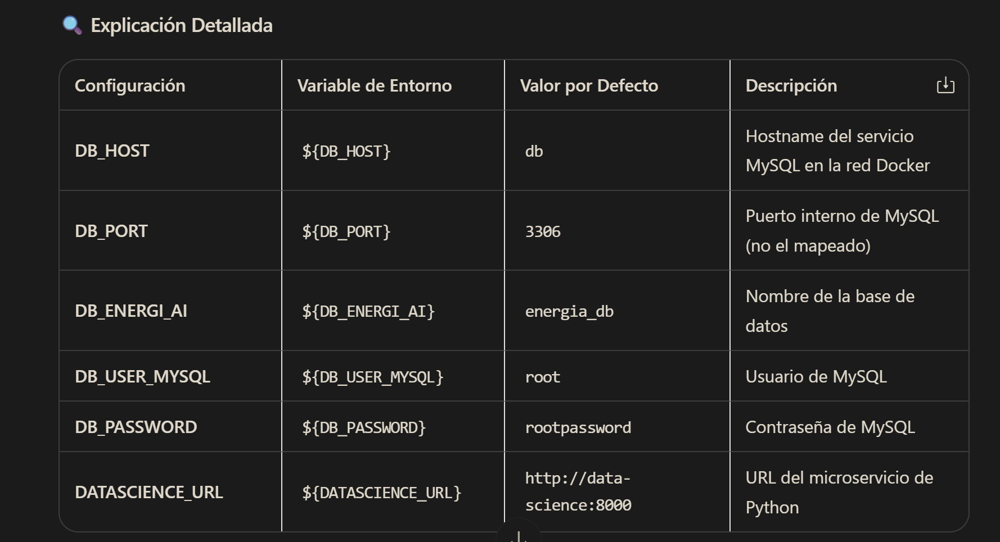
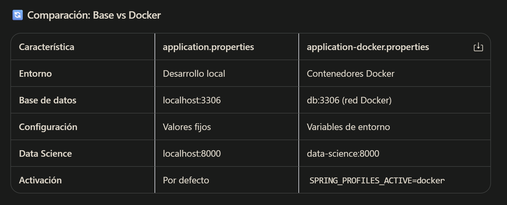
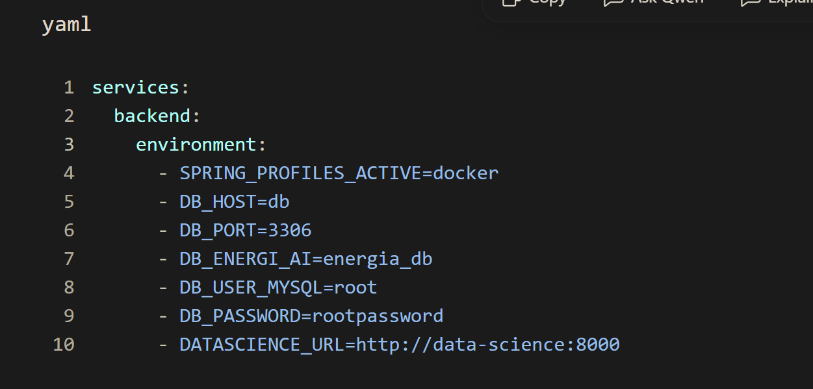
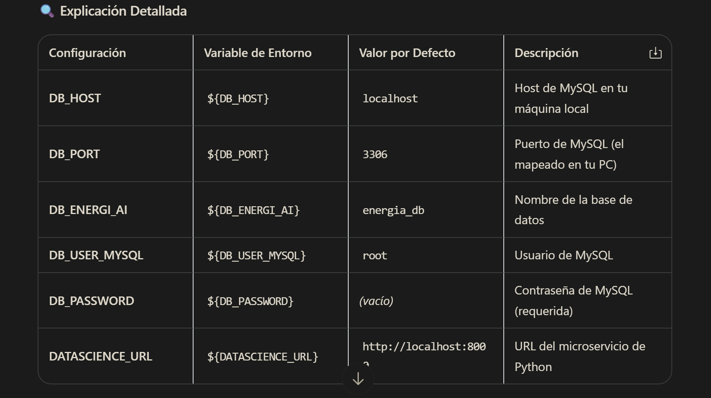
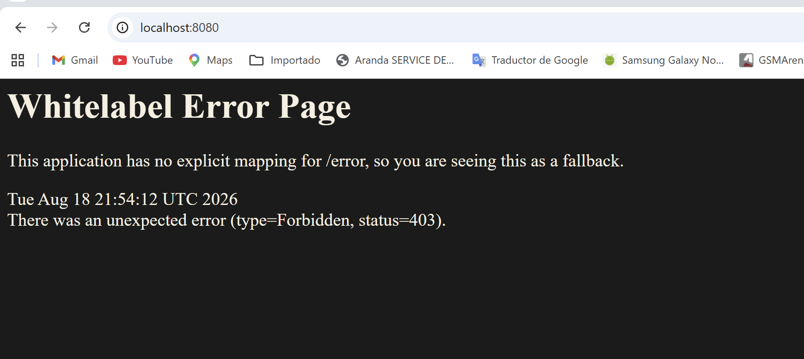

# Energia Backend API

Backend REST desarrollado con Spring Boot para analizar consumo energético, clasificar eficiencia, estimar costo mensual y generar recomendaciones de ahorro. El proyecto incluye autenticación JWT, documentación OpenAPI/Swagger, persistencia con Spring Data JPA y base de datos H2 en memoria.

## Tabla de contenido

- [Descripción general](#descripción-general)
- [Stack tecnológico](#stack-tecnológico)
- [Arquitectura del proyecto](#arquitectura-del-proyecto)
- [Estructura de carpetas](#estructura-de-carpetas)
- [Requisitos previos](#requisitos-previos)
- [Configuración](#configuración)
- [Ejecución local](#ejecución-local)
- [Seguridad y autenticación](#seguridad-y-autenticación)
- [Documentación Swagger/OpenAPI](#documentación-swaggeropenapi)
- [Base de datos H2](#base-de-datos-h2)
- [Endpoints principales](#endpoints-principales)
- [Reglas de negocio](#reglas-de-negocio)
- [Validaciones](#validaciones)
- [Manejo de errores](#manejo-de-errores)
- [Pruebas](#pruebas)
- [Notas de seguridad](#notas-de-seguridad)
- [Configuración](#configuración)
    - [application.properties](#applicationproperties)
    - [application-docker-properties](#application-docker-properties)
    - [application-local-properties](#application-local-properties)
- [Requisitos previos para Docker](#requisitos-previos-para-docker)
- [Creacion del contenedor de Backend](#creacion-del-contenedor-de-backend)

## Descripción general

La aplicación permite registrar análisis de consumo energético a partir de datos como consumo mensual en kWh, uso en horario pico, cantidad de equipos, tipo de inmueble y horas de alto consumo. Con esa información, el backend:

- Clasifica el consumo como `Eficiente`, `Moderado` o `Ineficiente`.
- Calcula un costo mensual estimado usando una tarifa fija por kWh.
- Genera recomendaciones según la categoría y los patrones de consumo.
- Persiste el resultado en una base de datos H2 en memoria.
- Permite consultar análisis previamente creados por ID.
- Protege los endpoints de análisis mediante JWT.

## Stack tecnológico

| Tecnología | Uso |
| --- | --- |
| Java 21 | Lenguaje base del proyecto |
| Spring Boot 3.3.5 | Framework principal |
| Spring Web | Exposición de API REST |
| Spring Security | Seguridad HTTP y autenticación stateless |
| JJWT 0.12.6 | Generación y validación de tokens JWT |
| Spring Data JPA | Persistencia y repositorios |
| H2 Database | Base de datos en memoria para desarrollo/pruebas |
| Jakarta Validation | Validación de DTOs de entrada |
| Lombok 1.18.38 | Reducción de código repetitivo |
| SpringDoc OpenAPI 2.6.0 | Documentación interactiva de la API |
| Maven / Maven Wrapper | Gestión de dependencias, build y ejecución del proyecto |

## Arquitectura del proyecto

El proyecto sigue una arquitectura por capas:

- `controller`: expone endpoints REST.
- `service`: contiene la lógica de negocio del análisis energético.
- `repository`: abstrae el acceso a datos con Spring Data JPA.
- `entity`: define el modelo persistido en base de datos.
- `dto`: define contratos de entrada y salida de la API.
- `security`: gestiona JWT y autenticación por request.
- `config`: centraliza seguridad, OpenAPI, JSON, zona horaria y constantes.
- `exception`: maneja errores de forma centralizada.
- `enums`: define valores de dominio como categorías y tipos de inmueble.

## Estructura de carpetas

```text
.
├── pom.xml
├── mvnw
├── mvnw.cmd
├── HELP.md
└── src
    ├── main
    │   ├── java/com/hackathon/energia_backend
    │   │   ├── EnergiaBackendApplication.java
    │   │   ├── config
    │   │   ├── controller
    │   │   ├── dto
    │   │   ├── entity
    │   │   ├── enums
    │   │   ├── exception
    │   │   ├── repository
    │   │   ├── security
    │   │   └── service
    │   └── resources
    │       ├── application.properties
    │       └── static/swagger-custom.html
    └── test
        └── java/com/hackathon/energia_backend
```

## Requisitos previos

- Java 21.
- Maven instalado globalmente, o restaurar la configuración completa del Maven Wrapper.

> Nota: el repositorio contiene `mvnw` y `mvnw.cmd`, pero actualmente no contiene `.mvn/wrapper/maven-wrapper.properties`. Por eso, el wrapper no puede ejecutarse hasta que se restaure esa carpeta/configuración.

## Configuración

La configuración principal está en `src/main/resources/application.properties`.

Valores relevantes:

```properties
spring.application.name=energia-backend
server.port=8080

app.timezone=America/Bogota
spring.jackson.time-zone=America/Bogota
spring.jackson.date-format=yyyy-MM-dd HH:mm:ss

spring.datasource.url=jdbc:h2:mem:hackathon_db
spring.datasource.username=sa
spring.datasource.password=

spring.jpa.hibernate.ddl-auto=update
spring.h2.console.enabled=true
spring.h2.console.path=/h2-console

springdoc.api-docs.path=/v3/api-docs
springdoc.swagger-ui.path=/swagger-ui.html

app.jwt.expiration-ms=86400000
```

La aplicación usa la zona horaria `America/Bogota` por defecto para la JVM y para la serialización JSON.

## Ejecución local

Desde la raíz del proyecto:

Con Maven instalado:

```bash
mvn spring-boot:run
```

Si se restaura el Maven Wrapper:

- Windows: `.\mvnw.cmd spring-boot:run`
- Linux/macOS: `./mvnw spring-boot:run`

La API queda disponible en:

```text
http://localhost:8080
```

## Seguridad y autenticación

La autenticación está implementada con JWT. El endpoint de login es público y genera un token firmado. Los endpoints de análisis requieren enviar el token en el header `Authorization`.

Credenciales actuales para entorno de hackathon:

```text
Usuario: admin
Contraseña: hackathon2026
```

### Login

```http
POST /api/auth/login
Content-Type: application/json
```

Body:

```json
{
  "username": "admin",
  "password": "hackathon2026"
}
```

Respuesta exitosa:

```json
{
  "token": "eyJhbGciOiJIUzI1NiJ9..."
}
```

### Uso del token

Para consumir endpoints protegidos:

```http
Authorization: Bearer <token>
```

Ejemplo:

```bash
curl -X GET http://localhost:8080/api/analisis/1 \
  -H "Authorization: Bearer <token>"
```

## Documentación Swagger/OpenAPI

El proyecto incluye documentación interactiva con SpringDoc.

URLs disponibles:

- Swagger UI estándar: `http://localhost:8080/swagger-ui.html`
- OpenAPI JSON: `http://localhost:8080/v3/api-docs`
- Swagger custom: `http://localhost:8080/swagger-custom.html`

El archivo `swagger-custom.html` incluye una interfaz personalizada con manejo visual del estado de autenticación y campo para aplicar el token Bearer.

## Base de datos H2

La aplicación usa H2 en memoria:

```text
JDBC URL: jdbc:h2:mem:hackathon_db
Usuario: sa
Contraseña: sin contraseña
```

Consola H2:

```text
http://localhost:8080/h2-console
```

La tabla principal es:

```text
resultados_analisis
```

Campos principales persistidos:

- `id`
- `consumoKwh`
- `usoHorarioPico`
- `cantidadEquipos`
- `tipoInmueble`
- `categoria`
- `probabilidad`
- `costoEstimadoMensual`
- `fechaCreacion`

## Endpoints principales

### Autenticación

| Método | Ruta | Seguridad | Descripción |
| --- | --- | --- | --- |
| `POST` | `/api/auth/login` | Pública | Valida credenciales y genera un JWT |

### Análisis energético

| Método | Ruta | Seguridad | Descripción |
| --- | --- | --- | --- |
| `POST` | `/api/analisis` | JWT requerido | Crea un análisis energético |
| `GET` | `/api/analisis/{id}` | JWT requerido | Consulta un análisis guardado por ID |

## Crear análisis energético

```http
POST /api/analisis
Content-Type: application/json
Authorization: Bearer <token>
```

Body:

```json
{
  "consumoKwh": 420.5,
  "usoHorarioPico": true,
  "cantidadEquipos": 8,
  "tipoInmueble": "Oficina",
  "horasAltoConsumo": 8
}
```

Respuesta:

```json
{
  "categoria": "Moderado",
  "probabilidad": 0.7,
  "recomendaciones": [
    "Identificar oportunidades de ahorro en horarios pico",
    "Revisar equipos individuales con mayor consumo para optimizar el ratio",
    "Implementar apagado automático de equipos al cierre de jornada"
  ],
  "costo_estimado_mensual": 315.375,
  "idAnalisis": 1
}
```

## Consultar análisis por ID

```http
GET /api/analisis/{id}
Authorization: Bearer <token>
```

Ejemplo:

```bash
curl -X GET http://localhost:8080/api/analisis/1 \
  -H "Authorization: Bearer <token>"
```

## Reglas de negocio

La clasificación se calcula en `AnalisisEnergiaService` usando:

```text
ratio = consumoKwh / cantidadEquipos
```

| Condición | Categoría | Probabilidad base |
| --- | --- | --- |
| `ratio > 55` y `horasAltoConsumo > 7` | `Ineficiente` | `0.75` |
| `ratio < 28` y `horasAltoConsumo < 4` | `Eficiente` | `0.85` |
| Cualquier otro caso | `Moderado` | `0.70` |

El costo estimado mensual se calcula con una tarifa fija:

```text
costo_estimado_mensual = consumoKwh * 0.75
```

La tarifa está definida en:

```java
AppConfig.TARIFA_KWH = 0.75
```

## Recomendaciones generadas

Las recomendaciones dependen de la categoría y de algunos datos de entrada.

### Categoría Ineficiente

- Reducir horas de alto consumo.
- Evaluar equipos con alto consumo por unidad.
- Si usa horario pico, desplazar consumo a horarios no pico.

### Categoría Eficiente

- Mantener prácticas actuales de consumo.
- Monitorear periódicamente el consumo.

### Categoría Moderado

- Identificar oportunidades de ahorro en horarios pico.
- Si el ratio `kWh/equipo` es mayor a `40`, revisar equipos con mayor consumo.

### Reglas adicionales

- Si el inmueble es `Oficina`, se recomienda implementar apagado automático al cierre de jornada.
- Si hay más de `10` equipos, se recomienda considerar reemplazo por modelos con certificación energética.

## Validaciones

El DTO `AnalisisRequest` aplica las siguientes validaciones:

| Campo | Tipo | Reglas |
| --- | --- | --- |
| `consumoKwh` | `Double` | Obligatorio, mínimo `0.1` |
| `usoHorarioPico` | `Boolean` | Obligatorio |
| `cantidadEquipos` | `Integer` | Obligatorio, entre `1` y `50` |
| `tipoInmueble` | `String` | Obligatorio, valores: `Casa`, `Apartamento`, `Local`, `Oficina` |
| `horasAltoConsumo` | `Integer` | Obligatorio, entre `0` y `24` |

Ejemplo de error de validación:

```json
{
  "error": "Datos de entrada inválidos",
  "detalles": {
    "cantidadEquipos": "Debe haber al menos 1 equipo",
    "tipoInmueble": "El tipo debe ser Casa, Apartamento, Local u Oficina"
  }
}
```

## Manejo de errores

El proyecto incluye un manejador global con `@RestControllerAdvice`.

Casos cubiertos:

- `400 Bad Request`: errores de validación en DTOs.
- `404 Not Found`: errores cuyo mensaje contiene `no encontrado`.
- `500 Internal Server Error`: errores runtime no clasificados.
- `401 Unauthorized`: credenciales inválidas en login o acceso sin token válido a rutas protegidas.

## Pruebas

El proyecto incluye una prueba base de contexto Spring:

```text
EnergiaBackendApplicationTests.contextLoads()
```

Ejecutar pruebas con Maven instalado:

```bash

mvn test
```

Si se restaura el Maven Wrapper:

- Windows: `.\mvnw.cmd test`
- Linux/macOS: `./mvnw test`

## Estado actual de build local

Durante la revisión del proyecto se detectó lo siguiente:

- `.\mvnw.cmd test` no ejecuta porque falta `.mvn/wrapper/maven-wrapper.properties`.
- `mvn test` requiere Maven instalado globalmente; en el entorno revisado no estaba disponible en el `PATH`.

El código fuente y la configuración Maven están definidos en `pom.xml`, pero para ejecutar pruebas localmente se debe instalar Maven o restaurar correctamente el Maven Wrapper.

## Notas de seguridad

Este proyecto está configurado para un entorno de hackathon/desarrollo. Antes de llevarlo a producción, se recomienda:

- Mover `app.jwt.secret` a variables de entorno o gestor de secretos.
- Reemplazar las credenciales hardcodeadas de `AuthController` por usuarios persistidos con contraseñas hasheadas.
- Usar una base de datos persistente en lugar de H2 en memoria.
- Ajustar CORS a dominios reales del frontend.
- Evitar exponer la consola H2 en producción.
- Revisar el tiempo de expiración del JWT según el nivel de riesgo del sistema.

## Autoría y contexto

Proyecto backend para hackathon de consumo energético bajo el paquete base:

## Configuración


### application.properties

El archivo `application.properties` es el corazón de la configuración de Spring Boot. Centraliza todos los parámetros necesarios para el funcionamiento del backend, incluyendo:

- **Conexión a base de datos MySQL**
- **Configuración de JPA/Hibernate** (mapeo objeto-relacional)
- **Migraciones de base de datos con Flyway**
- **Documentación API con Swagger/OpenAPI**
- **Autenticación JWT** (tokens de seguridad)
- **Comunicación con el servicio de Data Science**
- **Endpoints de monitoreo y salud**

####  Contenido del archivo

```
properties
# ==========================================
# Configuración General (común para todos los perfiles)
# ==========================================
spring.application.name=energia-backend
server.port=8080

# ==========================================
# JPA / Hibernate
# ==========================================
spring.jpa.database-platform=org.hibernate.dialect.MySQLDialect
spring.jpa.hibernate.ddl-auto=update
spring.jpa.show-sql=true
spring.jpa.properties.hibernate.format_sql=true

# ==========================================
# Flyway
# ==========================================
spring.flyway.enabled=true
spring.flyway.baseline-on-migrate=true

# ==========================================
# Swagger / OpenAPI
# ==========================================
springdoc.api-docs.path=/v3/api-docs
springdoc.swagger-ui.path=/swagger-ui.html

# ==========================================
# JWT
# ==========================================
app.jwt.secret=MiClaveSecretaSuperSeguraDeAlMenos32CaracteresParaJWT!!!
app.jwt.expiration-ms=86400000

# ==========================================
# API Data Science (FastAPI)
# ==========================================
app.datascience.predict-path=/api/v1/predict/
app.datascience.connect-timeout-ms=5000
app.datascience.read-timeout-ms=10000

# ==========================================
# Expone solo el endpoint de salud para monitoreo básico,
# ocultando detalles internos de la app por seguridad.
# ==========================================
management.endpoints.web.exposure.include=health
management.endpoint.health.show-details=never


### application-docker-properties {#application-docker-properties}

Este archivo contiene la configuración **específica para el entorno de contenedores Docker**. Sobrescribe la configuración base (`application.properties`) cuando se activa el perfil `docker`.

####  Propósito Principal

- **Usa variables de entorno** inyectadas desde `docker-compose.yml` para mayor flexibilidad
- **Conecta con servicios Docker** usando sus nombres de red internos (`db`, `data-science`)
- **Permite personalización** sin recompilar la imagen del contenedor

####  Contenido del archivo

```
properties
# ==========================================
# Perfil: DOCKER (contenedores)
# ==========================================

# Base de datos MySQL dentro de Docker
spring.datasource.url=jdbc:mysql://${DB_HOST:db}:${DB_PORT:3306}/${DB_ENERGI_AI:energia_db}
spring.datasource.driver-class-name=com.mysql.cj.jdbc.Driver
spring.datasource.username=${DB_USER_MYSQL:root}
spring.datasource.password=${DB_PASSWORD:rootpassword}

# API Data Science dentro de Docker
app.datascience.base-url=${DATASCIENCE_URL:http://data-science:8000}



Características Clave
Sintaxis de Variables de Entorno: ${VARIABLE:valor_por_defecto}
Si la variable existe en docker-compose.yml, usa ese valor
Si no existe, usa el valor por defecto después de :
Nombres de Host Docker:
db: Nombre del servicio de MySQL en docker-compose.yml
data-science: Nombre del servicio de Python FastAPI
Flexibilidad: Permite cambiar credenciales y configuraciones sin modificar el código, solo editando el docker-compose.yml o un archivo .env



### Cómo se Activa
En tu docker-compose.yml, el servicio backend tiene:



Spring Boot detecta automáticamente application-docker.properties cuando el perfil activo es docker y sobrescribe las configuraciones del archivo base.
Nunca hardcodees credenciales en este archivo
Usa un archivo .env externo para producción y nunca lo subas al repositorio
Asegúrate de que los nombres de host (db, data-science) coincidan exactamente con los servicios en docker-compose.yml

### application-local-properties

Este archivo contiene la configuración **específica para desarrollo local** (IntelliJ IDEA o tu PC). Sobrescribe la configuración base (`application.properties`) cuando se activa el perfil `local`.

#### Propósito Principal

- **Desarrollo en máquina local** sin necesidad de Docker
- **Conecta con servicios corriendo en localhost** (MySQL y Data Science)
- **Ideal para debugging** y pruebas rápidas desde el IDE
- **Permite usar variables de entorno** del sistema operativo o valores por defecto

####  Contenido del archivo

```
properties
# ==========================================
# Perfil: LOCAL (IntelliJ / tu PC)
# ==========================================

# Base de datos MySQL local
spring.datasource.url=jdbc:mysql://${DB_HOST:localhost}:${DB_PORT:3306}/${DB_ENERGI_AI:energia_db}
spring.datasource.driver-class-name=com.mysql.cj.jdbc.Driver
spring.datasource.username=${DB_USER_MYSQL:root}
spring.datasource.password=${DB_PASSWORD}
#spring.datasource.password=${DB_PASSWORD:rootpassword}

# API Data Science local
app.datascience.base-url=${DATASCIENCE_URL:http://localhost:8000}



Características Clave
Password sin valor por defecto:
La línea spring.datasource.password=${DB_PASSWORD} no tiene valor por defecto
Esto es intencional por seguridad: obliga al desarrollador a definir la variable de entorno
La línea comentada #spring.datasource.password=${DB_PASSWORD:rootpassword} sirve como referencia
Hosts Locales:
localhost: Apunta a tu máquina física
Puerto 3306: Puerto estándar de MySQL (o el que hayas mapeado)
Flexibilidad: Puedes sobrescribir cualquier valor desde las variables de entorno de tu sistema operativo o desde IntelliJ IDEA


### Cómo se Activa
Opción 1: Desde IntelliJ IDEA
Ve a Run → Edit Configurations
En Active profiles escribe: local
En Environment variables agrega:

DB_HOST=localhost;DB_PORT=3306;DB_ENERGI_AI=energia_db;DB_USER_MYSQL=root;DB_PASSWORD=tuPassword

Opción 2: Desde línea de comandos

# Windows PowerShell
$env:SPRING_PROFILES_ACTIVE="local"
$env:DB_PASSWORD="tuPassword"
mvn spring-boot:run

# Linux/Mac
export SPRING_PROFILES_ACTIVE=local
export DB_PASSWORD="tuPassword"
mvn spring-boot:run

Importante
Nunca subas credenciales reales al repositorio: Si usas un archivo .env local, agrégalo a .gitignore
MySQL debe estar corriendo: A diferencia del perfil Docker, aquí no se levanta automáticamente
Puerto 3306 disponible: Si tienes otro MySQL corriendo, cambia DB_PORT en las variables de entorno
Data Science local: El servicio de Python debe estar activo en puerto 8000 para que las predicciones funcionen

## Requisitos previos para Docker {#requisitos-previos-para-docker}

Antes de construir o ejecutar el contenedor es necesario instalar **Docker Desktop** en el equipo; es la aplicación que permite crear, ejecutar y gestionar contenedores:

- **Descarga oficial (Windows / Mac / Linux):** <https://www.docker.com/products/docker-desktop/>
- **Guía oficial de instalación:** <https://docs.docker.com/get-started/get-docker/>
- **Guía específica para Windows:** <https://docs.docker.com/desktop/setup/install/windows-install/>

Pasos de instalación:

1. Descargar el instalador correspondiente a tu sistema operativo desde la página oficial de descarga.
2. Ejecutar el instalador. En Windows, aceptar habilitar **WSL 2** cuando lo solicite (el asistente lo configura automáticamente).
3. Reiniciar el equipo si el instalador lo pide, luego abrir **Docker Desktop** y esperar a que el ícono muestre "Engine running".
4. Verificar que la instalación quedó correcta abriendo una terminal:

```bash
docker --version
docker compose version
```
5. Confirmar que el motor de Docker está activo:

```bash
docker info
```

> ⚠️ Sin Docker Desktop instalado y en ejecución, los comandos `docker build` o `docker run` fallarán con errores como "command not found" o "cannot connect to the Docker daemon".


## Creacion del contenedor de Backend

El backend cuenta con un `Dockerfile` con **build multi-etapa**: la primera etapa compila el proyecto con Maven (Java 21) y la segunda ejecuta el JAR resultante sobre un JRE ligero, con un `HEALTHCHECK` sobre `/actuator/health`.

### Archivos involucrados

`backend/Dockerfile`:

```dockerfile
# Etapa 1: Compilar con Maven (Java 21)
FROM maven:3.9-eclipse-temurin-21-alpine AS builder
WORKDIR /app
COPY pom.xml .
RUN mvn dependency:go-offline
COPY src ./src
RUN mvn clean package -DskipTests

# Etapa 2: Ejecutar con JRE ligero (Java 21)
FROM eclipse-temurin:21-jre-alpine
WORKDIR /app

# Instalar wget para el healthcheck
RUN apk add --no-cache wget

COPY --from=builder /app/target/*.jar app.jar
EXPOSE 8080

# HEALTHCHECK antes del ENTRYPOINT
HEALTHCHECK --interval=30s --timeout=5s --start-period=60s --retries=3 \
  CMD wget -qO- http://localhost:8080/actuator/health || exit 1

ENTRYPOINT ["java", "-jar", "app.jar"]
```

`backend/.dockerignore`:

```text
target/
.git
.idea
*.iml
```

> El `.dockerignore` evita copiar dentro de la imagen la carpeta `target/`, el repositorio `.git` y los archivos del IDE, haciendo el build más rápido y liviano.

### 1. Construir la imagen

Desde la carpeta `backend`:

```bash
docker build -t energia-backend .
```
### 2 Verificar que la imagen existe:
   Puedes listar todas las imágenes que tienes en tu computadora con:
```
bash
   docker images

### 2. Subir el contenedor (ejecutar)

```
bash
docker run -d --name energia-backend -p 8080:8080 energia-backend
```

- `-d`: ejecuta en segundo plano (detached).
- `--name`: nombre del contenedor.
- `-p 8080:8080`: mapea el puerto 8080 del contenedor al 8080 del equipo.

La aplicación queda disponible en `http://localhost:8080`.


l error 403 Forbidden significa que tu aplicación Spring Boot está funcionando correctamente, 
pero Spring Security está bloqueando el acceso porque la ruta 
/ (la raíz de http://localhost:8080) no está configurada como pública y no has enviado 
credenciales de autenticación

### 3. Verificar logs y estado

```bash
# Ver logs en tiempo real (Ctrl + C para salir)
docker logs -f energia-backend

# Ver solo las últimas 100 líneas
docker logs --tail 100 energia-backend

# Ver contenedores en ejecución y su estado
docker ps

# Ver el resultado del healthcheck (healthy / starting / unhealthy)
docker inspect --format='{{.State.Health.Status}}' energia-backend
```

El healthcheck también se puede abrir en el navegador: `http://localhost:8080/actuator/health`.

### 4. Bajar el contenedor (detener y eliminar)

```
bash
# Detener el contenedor
docker stop energia-backend

# Eliminar el contenedor una vez detenido
docker rm energia-backend

# O detener y eliminar en un solo paso
docker rm -f energia-backend

# Volver a subirlo sin reconstruir la imagen
docker start energia-backend
```

### Nota

Si se modifica el código del backend, hay que **reconstruir la imagen** (`docker build -t energia-backend .`) o usar `docker compose up -d --build` para que el contenedor incluya los cambios.

```text
com.hackathon.energia_backend
```

El nombre de paquete usa guion bajo porque `com.hackathon.energia-backend` no es válido en Java.

